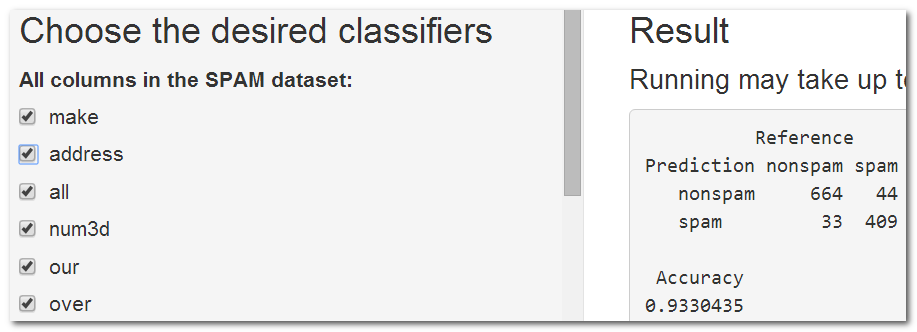
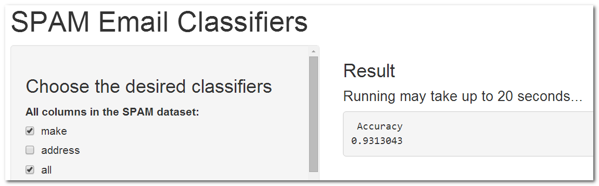

## SPAM Email Classifiers

Determine which classifiers are most suitable for predicting SPAM Emails

- Student: Thach-Ngoc TRAN
- ShinyApps Link: https://thachngoctran.shinyapps.io/RDir/
- ShinyApps Source Code (GitHub): https://goo.gl/pzlkud
- Slidify Presentation Link: https://thachngoctran.github.io/
- Slidify Source Code (GitHub): https://goo.gl/LHBJNJ

---

## Introduction

- Dataset: spam (library kernlab)

```{r echo=FALSE, results='hide', warning=FALSE, message=FALSE}
library(e1071)
library(shiny)
library(caret)
library(kernlab)
data(spam)
```

```{r}
dim(spam)
```

- Predictive Algorithm: Generalized Linear Models
- Training Set: 75%, Testing Set: 25%.
  - Splitting Method: Random Sampling.
  - createDataPartition() in library caret.

---

## ShinyApps Usage (1/2)

- In default, at first run, all columns (except the "type") are used to build the model.
- The accuracy will be:

```{r echo=FALSE, results='hide', warning=FALSE}
set.seed(32342)

inTrain <- createDataPartition(y=spam$type, p=0.75, list=FALSE)
training <- spam[inTrain,]
testing <- spam[-inTrain,]

myPredict <- function(chosenColumns){
    set.seed(32343)
    
    allNeededColumns = c(chosenColumns, "type")
    
    trainingTemp = training[, allNeededColumns]
    modelFit <- train(type ~., data=trainingTemp, method="glm")
    
    testingTemp = testing[, allNeededColumns]
    predictions <- predict(modelFit, newdata=testingTemp)
    
    k = confusionMatrix(predictions,testingTemp$type)
    k$overall["Accuracy"]
}

allColumns = c("make", "address", "all", "num3d", "our", "over", "remove", "internet", "order", "mail", "receive", "will", "people", "report", "addresses", "free", "business", "email", "you", "credit", "your", "font", "num000", "money", "hp", "hpl", "george", "num650", "lab", "labs", "telnet", "num857", "data", "num415", "num85", "technology", "num1999", "parts", "pm", "direct", "cs", "meeting", "original", "project", "re", "edu", "table", "conference", "charSemicolon", "charRoundbracket", "charSquarebracket", "charExclamation", "charDollar", "charHash", "capitalAve", "capitalLong", "capitalTotal")

res = myPredict(allColumns)

```

```{r echo=F}
res
```

- As on the ShinyApps:

</img>

---

## ShinyApps Usage (2/2)

- However, accuracy can be adjusted by using only certain columns. => choose in the left
- Let's say, drop column "address", the ShinyApps immediately re-computes the model.
- The new accuracy will be:

```{r echo=F, warning=F}
allColumns = c("make", "all", "num3d", "our", "over", "remove", "internet", "order", "mail", "receive", "will", "people", "report", "addresses", "free", "business", "email", "you", "credit", "your", "font", "num000", "money", "hp", "hpl", "george", "num650", "lab", "labs", "telnet", "num857", "data", "num415", "num85", "technology", "num1999", "parts", "pm", "direct", "cs", "meeting", "original", "project", "re", "edu", "table", "conference", "charSemicolon", "charRoundbracket", "charSquarebracket", "charExclamation", "charDollar", "charHash", "capitalAve", "capitalLong", "capitalTotal")

myPredict(allColumns)
```

- As on the ShinyApps:

</img>

---

## Conclusion

- We have used the predictive algorithm "Generalized Linear Models" against the dataset "spam" to build a model for classifying emails (spam vs. nonspam).
- Users can choose which classifiers are most suitable to maximize accuracy.
- Future work:
  - Allow to choose more predictive algorithms, e.g.: Random Forest.
  - Allow to change the proportions of dataset for training and testing, e.g.: 60/40.
