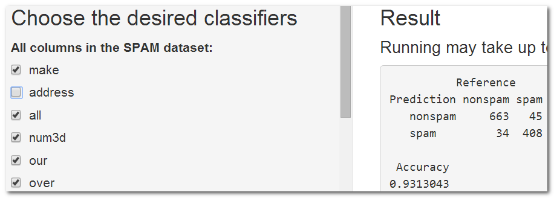

## SPAM Email Classifiers

Determine which classifiers are most suitable for predicting SPAM Emails

- Student: Thach-Ngoc TRAN
- ShinyApps Link: https://thachngoctran.shinyapps.io/RDir/
- ShinyApps Source Code (GitHub): https://goo.gl/pzlkud
- Slidify Presentation Link: https://thachngoctran.github.io/
- Slidify Source Code (GitHub): https://goo.gl/LHBJNJ

---

## Introduction

- Dataset: spam (library kernlab)


```r
dim(spam)
```

```
## [1] 4601   58
```

- Predictive Algorithm: Generalized Linear Models
- Training Set: 75%, Testing Set: 25%.
  - Splitting Method: Random Sampling.
  - createDataPartition() in library caret.

---

## ShinyApps Usage (1/2)

- In default, at first run, all columns (except the "type") are used to build the model.
- The accuracy will be:


```
##           Reference
## Prediction nonspam spam
##    nonspam     664   44
##    spam         33  409
```

```
##  Accuracy 
## 0.9330435
```

- As on the ShinyApps:

</img>

---

## ShinyApps Usage (2/2)

- However, accuracy can be adjusted by using only certain columns. => choose in the left
- Let's say, drop column "address", the ShinyApps immediately re-computes the model.


```
##           Reference
## Prediction nonspam spam
##    nonspam     663   45
##    spam         34  408
```

```
##  Accuracy 
## 0.9313043
```
- As on the ShinyApps:

</img>

---

## Conclusion

- We have used the predictive algorithm "Generalized Linear Models" against the dataset "spam" to build a model for classifying emails (spam vs. nonspam).
- Users can choose which classifiers are most suitable to maximize accuracy.
- Future work:
  - Allow to choose more predictive algorithms, e.g.: Random Forest.
  - Allow to change the proportions of dataset for training and testing, e.g.: 60/40.
